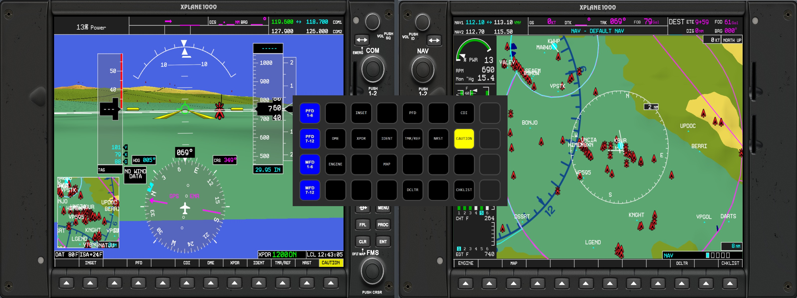
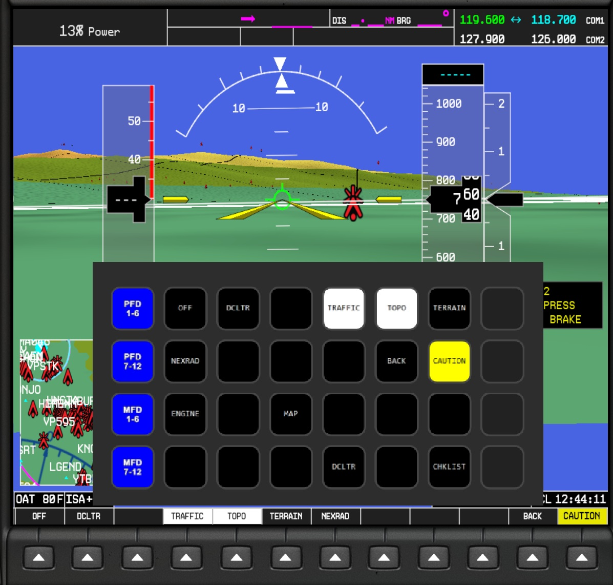
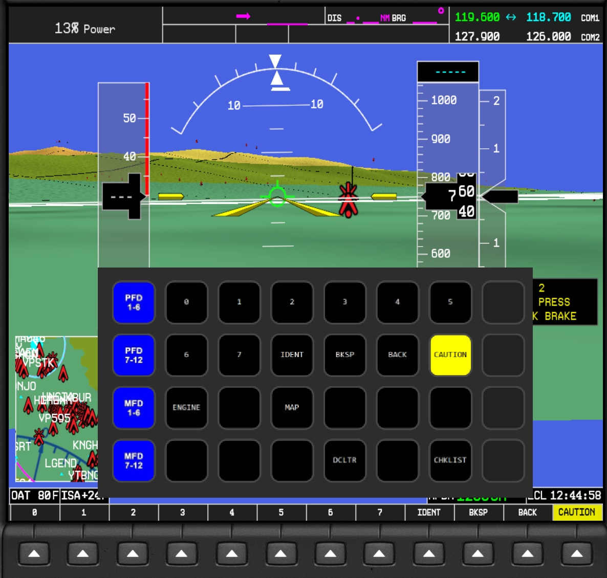

# GlassLinkXP

Puts the **live** G1000 softkey labels on a Stream Deck.

X-Plane 12 draws the G1000's softkey labels straight to the screen and offers
no dataref for them, so a Stream Deck can send `sim/GPS/g1000n1_softkey1..12`
but can only show a static "BTN 1..12" face. GlassLinkXP reads the labels back
out of the picture and republishes them as X-Plane datarefs, so a Stream Deck
button (via PilotsDeck) can show what the key actually does.

🚨 **This is experimental.** 🚨 \
It has been run against a live X-Plane and publishes real datarefs, but large 
parts of the Windows/sim integration are lightly exercised so far. Expect 
rough edges.

## Screenshots

This project was designed with PilotsDeck/StreamDeck integration in mind, but 
the datarefs are there and can be used any way you'd like. \

 \
\
 \
\


## Install

Requires Windows and X-Plane 12.1.1+ (for its web API).

1. Download the latest `glasslinkxp-<version>.zip` from the
   [Releases page](../../releases), and extract it anywhere.
2. Double-click **`install.cmd`** in the extracted folder.

   It copies GlassLinkXP into `%appdata%\GlassLinkXP`, downloads its Python
   environment and OCR language data, adds a **GlassLinkXP** shortcut to your
   desktop, and offers to install the small X-Plane plugin GlassLinkXP
   publishes into (say yes -- without it there is nowhere for the labels to
   go).

   That last step checks X-Plane for [XPPython3](https://xppython3.readthedocs.io/),
   the add-on that runs Python plugins at all, and downloads it first if it is
   not already there. It brings its own Python and installs only into
   `X-Plane/Resources/plugins`. If you would rather do that part yourself,
   answer no and install it by hand -- GlassLinkXP's plugin is copied in
   either way, and starts working once XPPython3 is beside it.

### Updating

Run `install.cmd` again. It asks before replacing the installed app, and
keeps the two files that are yours:

* **`config.toml`** — calibration, tuning, window titles. Settings this
  version adds are filled in at their documented value, settings it no longer
  has are dropped, and anything you had set is left as you set it.
* **`labels.txt`** — the vocabulary, which you can edit in the Vocabulary tab.
  Labels this version adds are appended, labels it retires are removed, and
  labels *you* added are never touched (`labels.shipped.txt` beside it is how
  it tells the difference — leave it alone).

The previous version of each is kept as `.bak`, and the installer prints
exactly what it changed.

One consequence worth knowing: because a value you already have is never
overwritten, a *changed* default does not reach you on update. If a release
retunes something, the notes will say so and you can set it yourself.

## First run

Start X-Plane with your aircraft **on the ground**, then open GlassLinkXP
from the desktop shortcut. With nothing configured yet it starts setup: a bar
across the top of the window that takes you through six steps, one at a time,
opening the right tab for each and staying put while you work in it.

1. Start X-Plane, aircraft on the ground (this creates your config file).
2. Find the PFD and MFD pop-out windows.
3. Draw a box around the softkey strip — the step that decides whether
   anything reads correctly.
4. Check what is actually being read, and tune it if a label comes out wrong.
5. Watch the labels locally, without touching X-Plane.
6. Publish them to X-Plane.

Press **Next** to move on; it warns you if a step looks unfinished, but never
stops you. **Close setup** puts the bar away and remembers where you were —
the Start here tab offers to resume from that step.

If you have no X-Plane to hand yet, the Start here tab can generate sample
pictures so you can see the whole thing work first.

## Wiring a PilotsDeck button

A StreamDeck profile using PilotsDeck composite action buttons is available 
[here](docs/PilotsDeck-profile/GlassLinkXP_Buttons.streamDeckProfile).

For PFD softkey 1:

| Field | Value |
| --- | --- |
| Command (press) | `sim/GPS/g1000n1_softkey1` |
| Display value | `glasslinkxp/softkey/pfd/1:s64` |

`:s64` is PilotsDeck's string-dataref address syntax: read 64 bytes as a
NUL-terminated string.

Alongside each label, GlassLinkXP also publishes the colour of the cell the
label sits on, as an int dataref:

| dataref | value |
| --- | --- |
| `glasslinkxp/softkey/pfd/1/bg` | `0` black, `1` white (selected/inverted), `2` yellow, `3` red |

Use it to pick the button image or background. Check the classification
against your own display with the Colours tab (or `glasslinkxp dump-colors`)
before relying on it.

Softkey N maps to `sim/GPS/g1000n1_softkeyN` (pilot PFD) and
`sim/GPS/g1000n3_softkeyN` (MFD); `g1000n2` is the copilot PFD and is not
supported.

## Configuration

`docs/CONFIGURATION.md` documents every setting; the Settings tab in the
window shows the same text beside each field. `config.example.toml` in your install folder is a
commented starting point if you would rather edit `config.toml` by hand.

`labels.txt` (Vocabulary tab) is the list of labels a reading is corrected
to. It is aircraft and G1000 version dependent -- add anything your setup
shows that is missing; your additions survive updates.

## Troubleshooting

| Symptom | Likely cause |
| --- | --- |
| `no visible window title contains ...` | The display is not popped out, or the title differs. Use Find windows. |
| Find windows lists nothing | Only X-Plane's own windows are listed by default. Tick *Show every window*. |
| A pop-out ends up smaller than expected | X-Plane enforces a minimum size; the log says what it settled at. Recalibrate against that size. |
| Labels froze and stopped following the sim | The pop-out was closed. It is reopened automatically within a cycle unless window management is off. |
| `could not initialise Tesseract` | The OCR language data was not found. Re-run `install.cmd`, or point `ocr.tessdata_path` at the folder holding `eng.traineddata`. |
| `X-Plane Web API unreachable` | X-Plane is not running, is older than 12.1.1, or its web server is off (Settings -> Network). |
| `N of 48 datarefs are not registered in X-Plane` | The X-Plane plugin is not installed, or failed to load. Check `Log.txt` and `XPPython3.log` in the X-Plane folder, or re-run `scripts\install-xplane-plugin.ps1` from your install folder. |
| Labels are garbage or empty | Almost always geometry. Open the Calibrate tab and check the boxes, or the Cells tab to see exactly what is being read. |
| One cell is always wrong | A missing entry in `labels.txt`, or a label the sim draws on two lines (not supported -- see known limitations). |
| The window says "this Python has no Tk support" | Re-run the installer; the command line still works without it. |

Run any command with `-v` for debug logging (per-cell raw OCR strings,
confidences and match scores).

## Reporting a problem

[Open an issue](../../issues/new/choose) -- there is a form for a bug and one
for an idea. The bug form asks for a couple of things worth gathering first,
because they are what actually settles a wrong label:

```
.\glasslinkxp.cmd run --once -v      # what was read, per cell
.\glasslinkxp.cmd dump-cells             # what Tesseract was shown
```

Every log starts with the version it came from
(`GlassLinkXP 1.2.3: run`), so pasting the log answers that question too.

Attach the `dump-cells` images and debug logs (`-v`/`Debug Output` enabled). Every 
hard reading bug in this project so far has been diagnosed from a picture of the preprocessed 
cell and none from a description of one -- the screen is the only source of truth 
here, and it is a small, anti-aliased picture.

## More

[`docs/PIPELINE.md`](docs/PIPELINE.md) has flowcharts of the daemon loop and of
what happens to a single frame. [`docs/GUI.md`](docs/GUI.md) covers the window.
[`docs/CONFIGURATION.md`](docs/CONFIGURATION.md) is the full settings reference.

## Working on it

[`docs/DEVELOPER.md`](docs/DEVELOPER.md) has the project layout, how to run
the whole pipeline with no Windows and no X-Plane, latency numbers, known
limitations, and exactly what has and has not been verified.
[`CLAUDE.md`](CLAUDE.md) has the conventions this codebase is written to.

`src/` is the release: zipped as-is, it is what the Releases page serves and
what `install.cmd` installs from, so anything needed at install time lives in
there. Everything else in the repository is development-only.

```
uv sync --project src --locked             # the venv lands in src/.venv
xvfb-run -a src/.venv/bin/python -m pytest -q
src/.venv/bin/python tools/make_zip.py     # -> dist/glasslinkxp-0.0.0.zip
```

Releases are cut by publishing a GitHub release tagged `vX.Y.Z`: a workflow
zips `src/`, stamps that version into it and attaches it. Nothing in the tree
carries a version -- it says `0.0.0` until a release names one. See
[*Releasing*](docs/DEVELOPER.md#releasing).
