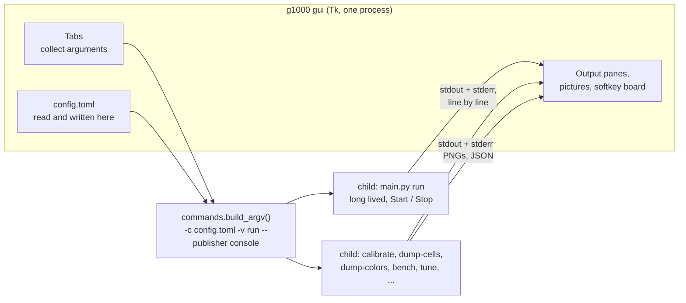
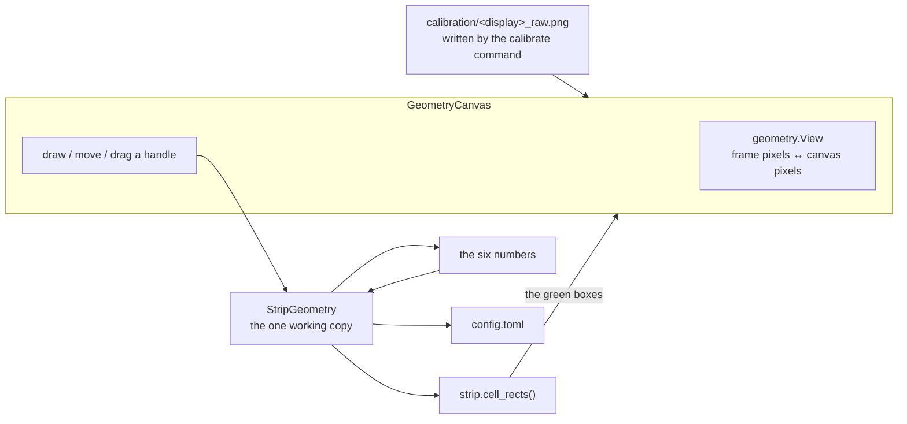

# The window

`g1000 gui` opens a window over the same commands the CLI has. It exists
because the people this project is for are pilots rather than programmers, and
the setup it needs -- find a window title, discover where a strip of pixels
sits inside it, and write both into a TOML file -- is a lot to ask of somebody
at a command prompt.

For what the daemon does once it is running, see [PIPELINE.md](PIPELINE.md).

## What it is, and what it is not

The GUI runs no part of the pipeline itself. Every button spawns
`python -m g1000_softkey.main <subcommand>` and shows what it said.



Three consequences, and all three are the reason for the shape:

* **The GUI cannot drift from the documentation.** It has no second
  implementation of anything to drift *with*. A bug reproduced in the window
  reproduces on the command line, and the exact command is printed above every
  run's output so it can be pasted into a shell or an issue.
* **A crash in capture or OCR takes down a child, not the window.**
* **Stop is a signal, not a flag.** `cmd_run` installs handlers for SIGINT,
  SIGTERM and (on Windows) SIGBREAK, so Stop goes through the same shutdown
  path Ctrl-C does and the `finally` block still closes the WebSocket, the
  Tesseract API and the capture sources.

`cmd_run` also calls `signal.signal`, which only works on the main thread --
which Tk owns. Running the daemon in-process was never an option.

## Two children, never one

The daemon is long lived and the user starts and stops it deliberately;
everything else is a one-shot that finishes on its own. They get separate
process slots so that pressing **Take a picture** cannot silently kill a
running daemon.

## The tabs

| Tab | Runs | For |
| --- | --- | --- |
| Start here | `synth` | The six steps of setting this up, each with a button to the tab that does it. And a way to try the whole thing with no X-Plane. |
| Run | `run` | Start/stop, the publisher, the rate, debug output, and a live board of the twelve softkeys per display. |
| Find windows | `list-windows` | Pick the pop-out windows off a list; applying one writes `window_title` into the config. Windows only. |
| Calibrate | `calibrate` | Draw the strip on the captured frame with the mouse, judge it in a magnified close-up, and work through three steps. See below. |
| Cells | `dump-cells`, `tune` | Every cell as Tesseract receives it, next to the raw crop. Tune searches preprocessing settings against one cell that reads wrongly. |
| Colours | `dump-colors` | Each cell's ring BGR/HSV and how it classified, with the rows drawn in the colour they were called. |
| Pages | `screen-template`, `learn` | Record a softkey page into `screens.toml`; learn glyph shapes into `signatures.json`. |
| Vocabulary | -- | `labels.txt` in an editor. |
| Settings | -- | Every setting in the config file, as a form, plus a raw TOML editor. |
| Tools | `bench`, `synth` | Timings, and synthetic frames. |

## The calibration editor

This is the one tab that does something the CLI cannot, and it is the tab the
whole setup lives or dies on: nearly every bad reading later turns out to be a
box in the wrong place, and nobody can look at `x = 0.0273` and say whether it
is right.

So the strip is drawn on the captured frame with the mouse -- press **Draw a
new box** and drag from any corner to the opposite one -- and then made exact
in three steps, in this order:

1. **Place the top-left corner.** Every other number is measured from it: set
   the width before the left edge and you have to set it again afterwards.
2. **Bring in the other two edges** by setting the width and height.
3. **Trim the cells**, so each green box holds one whole label and no
   separator bar.

Each step brings its own nudge buttons, its own arrow-key bindings and its own
view: the close-up magnifies the top-left corner for step 1, the bottom-right
for step 2, and shows the whole strip for step 3. All three come from one table
(`CALIBRATION_STEPS` in `tabs.py`), so the panel, the buttons and the keys
cannot describe different things.

Nudges are in **frame pixels**, not fractions. "Just inside the edge of the
strip" is a statement about pixels, and asking someone to convert it into a
change in the fourth decimal place of a fraction is asking them to do
arithmetic to press a button.



The important arrow is `strip.cell_rects()`. The canvas does **not** work out
where the cells are; it draws what the function `split_cells` slices with. A
second implementation would be a calibration editor capable of disagreeing
with the thing it calibrates, and the user would line the boxes up carefully
against a picture that was lying to them. `tests/test_gui_canvas.py` reads the
green rectangles back off the canvas and compares them with `cell_rects` for
several geometries.

### The clipping warning

The editor can show where the boxes are, but not what is inside them. So it
runs the daemon's own crop over the captured frame and asks the question
`run -v` asks of every cell: does the ink reach the outermost pixel? Cells
that do are drawn **amber** instead of green, named in a line under the
close-up, and listed in a confirmation when **Save** is pressed.

It is asked, not refused. The check has both kinds of error -- a label drawn
hard against the edge of its own cell reports a clipping that is really the
sim's layout, and a crop that has slipped wholesale onto a separator bar or a
solid background reports nothing at all. A warning that blocked the save would
eventually be worked around by whoever hit the false positive, at which point
it has taught them to ignore it.

The margin is zero pixels, and that is a definition rather than a tuned value.
It began as 2% of the cell width; measuring the ink extents across the offline
corpus at a geometry known to be right showed that long labels legitimately
come within *one* pixel of the crop edge, while nothing correctly cropped ever
reaches the outermost pixel. There is no gap between "close" and "cut" to put
a percentage in. `tests/test_gui_checks.py` keeps that measurement as a
regression across every synthetic frame.

The check costs about five milliseconds, which is slower than a drag produces
changes, so it is debounced: free while the mouse is moving, immediate once it
stops. Blank cells are skipped on the same test the pipeline uses to decide a
cell never reaches OCR -- the G1000 leaves plenty of softkeys empty, and every
one of them would otherwise report ink touching nothing at all.

Two things in there are worth knowing about:

* **The view is computed on demand, not cached.** Redrawing is debounced, so a
  cached mapping goes stale for a tenth of a second after any resize -- and
  every press in that window would be mapped through the old scale and land
  somewhere the user never clicked. This was a real bug, found by the first
  test that drove a real mouse drag.
* **"Draw a new box" has to be a button.** Once a box is on screen there is
  nowhere left to start a fresh drag: near an edge is a resize, inside is a
  move. That is correct behaviour for an editor, and it is why drawing is
  something you ask for rather than a gap you have to find.

**Debug output** appears twice on purpose: once in the header, where it applies
to whatever command any tab runs, and once on the Run tab beside Start, because
that is where somebody chasing a bad label looks for it. Both are views of one
Tk variable, so they cannot disagree. It becomes `-v` on the child's command
line and is therefore fixed for the life of that child -- toggling it while the
daemon is running says so in the status bar rather than appearing to do
nothing.

The frame source at the top of the window is the shared `--image` argument. Set
it to a PNG or a folder of PNGs and every tab reads from saved pictures instead
of a live window, which is how the whole GUI can be used -- and is tested --
with no Windows and no X-Plane.

## The couplings, and what holds them

The GUI reads several things it did not write. Both are pinned by a test, so a
change to either fails the suite rather than the user's window:

| The GUI parses | Written by | Held by |
| --- | --- | --- |
| the argv every button builds | `main.build_parser()` | `tests/test_gui_commands.py` parses every possible argv with the real parser, and asserts the GUI covers every subcommand the CLI has |
| the daemon's `[pfd] 1:INSET \| ...` log rows | `main._format_row()` | `tests/test_gui_logparse.py` formats a `DisplayResult` with `_format_row` and parses it back |
| every config setting | the dataclasses in `config.py` | `tests/test_gui_schema.py` fails if a field is neither in `gui/schema.py` nor in `NOT_IN_THE_FORM` with a reason |
| where the strip and its cells are | `strip.strip_rect` / `strip.cell_rects` | `tests/test_gui_geometry.py` compares the editor's pixels with theirs; `tests/test_gui_canvas.py` reads the drawn boxes back off the canvas |
| whether a crop cuts a label | `strip.clipped_edges` | shared outright: the editor's amber boxes and `run -v`'s `CLIPPED?` are the same function |

The alternative to parsing the log rows was a second, machine-readable output
mode on `run`. That would be a second thing to keep correct, and a board fed
from a path the CLI does not use is a board that can agree with itself while
disagreeing with the daemon. What the board shows is what the daemon said.

## Files

```
g1000_softkey/gui/
  __init__.py   launch(); the message when Tk is missing
  __main__.py   python -m g1000_softkey.gui
  app.py        the window: shared state, the two child processes, the tab strip
  tabs.py       one class per tab
  widgets.py    output pane, image view, the softkey board, form helpers
  commands.py   every subcommand the GUI can run, as data, and argv building
  geometry.py   fractions ↔ frame pixels ↔ canvas pixels, and the clamping (no Tk)
  checks.py     runs the daemon's crop over the frame and reports clipped cells
  runner.py     child process + reader thread + event queue (no Tk)
  logparse.py   the daemon's log rows back into labels and colours
  schema.py     every config setting, with the text that explains it
  configio.py   config.toml in and out, including the small TOML writer
  prefs.py      which config file was open last; not stored in config.toml
```

Nothing outside `app.py`, `tabs.py` and `widgets.py` imports Tk, which is why
most of the GUI is tested without a display.

## Writing config.toml

The daemon reads TOML and never writes it, and the standard library only
reads. Rather than take a dependency, `configio.py` carries a small writer for
this config's own shapes. It is closed by a round trip: write a document, load
it back through the daemon's `load_config`, compare against what it started
from.

The one thing it cannot do is keep comments. So saving from the form copies the
previous file to `config.toml.bak` first, and the **Raw file** tab writes text
through unchanged for anyone who keeps notes in there.
