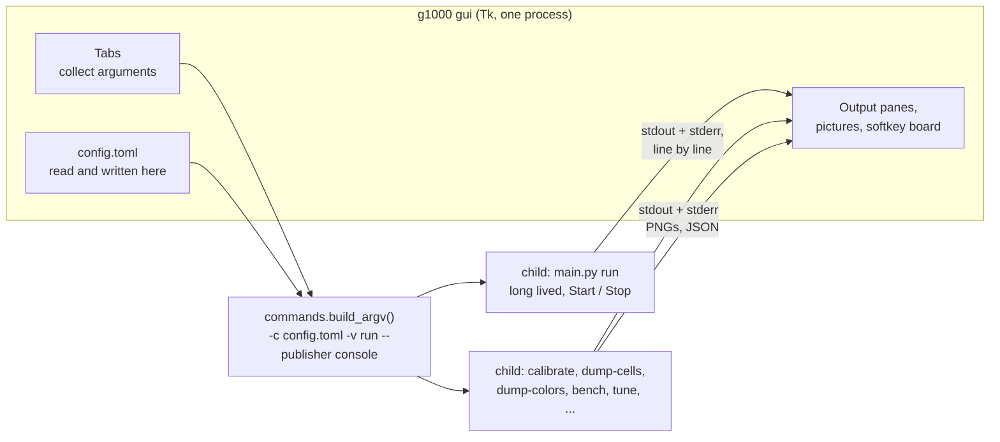

# The window

`g1000 gui` opens a window over the same commands the CLI has. It exists
because the people this project is for are pilots rather than programmers, and
the setup it needs -- find a window title, discover where a strip of pixels
sits inside it, and write both into a TOML file -- is a lot to ask of somebody
at a command prompt.

For what the daemon does once it is running, see [PIPELINE.md](PIPELINE.md).

## What it is, and what it is not

The GUI runs no part of the pipeline itself. Every button spawns
`python -m g1000_softkey.main <subcommand>` and shows what it said.



Three consequences, and all three are the reason for the shape:

* **The GUI cannot drift from the documentation.** It has no second
  implementation of anything to drift *with*. A bug reproduced in the window
  reproduces on the command line, and the exact command is printed above every
  run's output so it can be pasted into a shell or an issue.
* **A crash in capture or OCR takes down a child, not the window.**
* **Stop is a signal, not a flag.** `cmd_run` installs handlers for SIGINT,
  SIGTERM and (on Windows) SIGBREAK, so Stop goes through the same shutdown
  path Ctrl-C does and the `finally` block still closes the WebSocket, the
  Tesseract API and the capture sources.

`cmd_run` also calls `signal.signal`, which only works on the main thread --
which Tk owns. Running the daemon in-process was never an option.

## Two children, never one

The daemon is long lived and the user starts and stops it deliberately;
everything else is a one-shot that finishes on its own. They get separate
process slots so that pressing **Take a picture** cannot silently kill a
running daemon.

## The tabs

| Tab | Runs | For |
| --- | --- | --- |
| Start here | `synth` | The six steps of setting this up, each with a button to the tab that does it. And a way to try the whole thing with no X-Plane. |
| Run | `run` | Start/stop, the publisher and rate, and a live board of the twelve softkeys per display. |
| Find windows | `list-windows` | Pick the pop-out windows off a list; applying one writes `window_title` into the config. Windows only. |
| Calibrate | `calibrate` | The overlay picture with the twelve boxes drawn on the frame, the auto-detected geometry, and the fields to nudge it. |
| Cells | `dump-cells`, `tune` | Every cell as Tesseract receives it, next to the raw crop. Tune searches preprocessing settings against one cell that reads wrongly. |
| Colours | `dump-colors` | Each cell's ring BGR/HSV and how it classified, with the rows drawn in the colour they were called. |
| Pages | `screen-template`, `learn` | Record a softkey page into `screens.toml`; learn glyph shapes into `signatures.json`. |
| Vocabulary | -- | `labels.txt` in an editor. |
| Settings | -- | Every setting in the config file, as a form, plus a raw TOML editor. |
| Tools | `bench`, `synth` | Timings, and synthetic frames. |

The frame source at the top of the window is the shared `--image` argument. Set
it to a PNG or a folder of PNGs and every tab reads from saved pictures instead
of a live window, which is how the whole GUI can be used -- and is tested --
with no Windows and no X-Plane.

## The couplings, and what holds them

The GUI reads two things it did not write. Both are pinned by a test, so a
change to either fails the suite rather than the user's window:

| The GUI parses | Written by | Held by |
| --- | --- | --- |
| the argv every button builds | `main.build_parser()` | `tests/test_gui_commands.py` parses every possible argv with the real parser, and asserts the GUI covers every subcommand the CLI has |
| the daemon's `[pfd] 1:INSET \| ...` log rows | `main._format_row()` | `tests/test_gui_logparse.py` formats a `DisplayResult` with `_format_row` and parses it back |
| every config setting | the dataclasses in `config.py` | `tests/test_gui_schema.py` fails if a field is neither in `gui/schema.py` nor in `NOT_IN_THE_FORM` with a reason |

The alternative to parsing the log rows was a second, machine-readable output
mode on `run`. That would be a second thing to keep correct, and a board fed
from a path the CLI does not use is a board that can agree with itself while
disagreeing with the daemon. What the board shows is what the daemon said.

## Files

```
g1000_softkey/gui/
  __init__.py   launch(); the message when Tk is missing
  __main__.py   python -m g1000_softkey.gui
  app.py        the window: shared state, the two child processes, the tab strip
  tabs.py       one class per tab
  widgets.py    output pane, image view, the softkey board, form helpers
  commands.py   every subcommand the GUI can run, as data, and argv building
  runner.py     child process + reader thread + event queue (no Tk)
  logparse.py   the daemon's log rows back into labels and colours
  schema.py     every config setting, with the text that explains it
  configio.py   config.toml in and out, including the small TOML writer
  prefs.py      which config file was open last; not stored in config.toml
```

Nothing outside `app.py`, `tabs.py` and `widgets.py` imports Tk, which is why
most of the GUI is tested without a display.

## Writing config.toml

The daemon reads TOML and never writes it, and the standard library only
reads. Rather than take a dependency, `configio.py` carries a small writer for
this config's own shapes. It is closed by a round trip: write a document, load
it back through the daemon's `load_config`, compare against what it started
from.

The one thing it cannot do is keep comments. So saving from the form copies the
previous file to `config.toml.bak` first, and the **Raw file** tab writes text
through unchanged for anyone who keeps notes in there.
