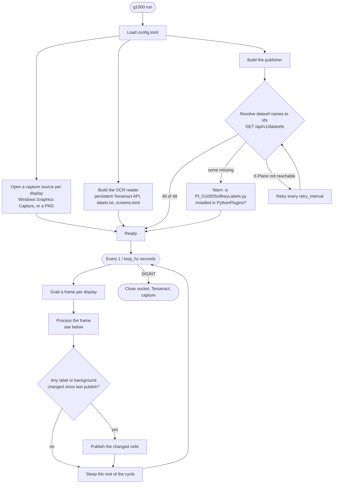
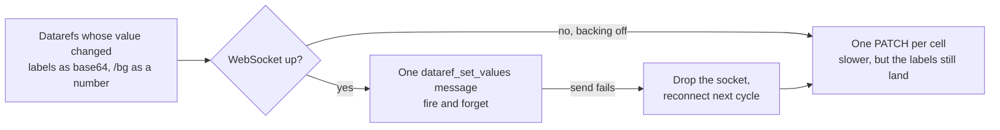
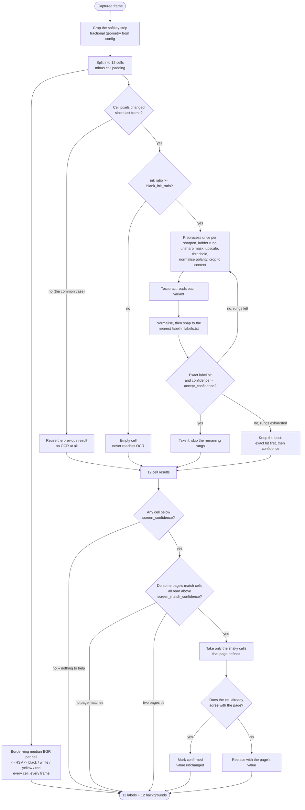

# How the daemon works

Two views: what happens once at startup and on every cycle, and what happens to
a single captured frame.

For the window that drives all of this -- what it spawns, and the places it
reads what the daemon printed -- see [GUI.md](GUI.md).

## The daemon



Publishing prefers one WebSocket message for the whole strip and falls back to
one REST write per changed cell:



## One frame



### Why it is shaped like this

**Change gating first.** Softkeys change rarely, so almost every cycle finds
nothing new and costs one crop and one array compare. All the expensive work
below only runs on cells whose pixels actually moved.

**Colour is measured outside the gate.** The gate exists to skip OCR, which
is the expensive stage; a median over a cell's border ring is not, so it runs
for all 12 cells on every frame. That is not just tidiness: a softkey becoming
selected changes the cell's background and leaves the label character for
character identical, which is the one event this feature most needs to get
right. Measuring outside the gate means it is caught whether or not the
grayscale comparison happens to notice.

The colour is taken from the outermost few pixels of the cell, because labels
are centred and a border ring is therefore essentially never glyph -- and,
unlike a whole-cell statistic, the ring needs no assumption about the glyphs
being the minority class, so it behaves the same on an inverted cell. It is
summarised with a median so a handful of clipped pixels from the green softkey
outline cannot drag it. Classification then tests V, then S, then hue: hue and
saturation barely move when the display is dimmed, so brightness can only ever
push a cell into black and can never turn a yellow into a red. See the
`dump-colors` subcommand for the measurement the thresholds should come from.

**A ladder rather than one sharpening setting.** The glyphs are around ten
pixels tall. Thresholding at that size can close the counters of 0, 6, 8 and 9,
and a filled counter is not a character -- Tesseract returns an empty string
rather than a wrong digit. Sharpening reopens them, but too much rings and
grows strokes instead, turning a 0 into a B. The amount that works depends on
the font and the capture scale, so each rung is tried and the answer the
vocabulary agrees with wins. The first rung is no sharpening at all.

**Confidence gates the early exit.** Landing on a known label is not proof:
every digit 0-7 is a valid softkey, so a 0 misread as 2 still matches exactly.
Only a hit that is also confident ends the search.

**Page lookup runs only when something needs it.** The stage exists to serve
cells OCR was unsure about, so the first question is whether any exist. When
every cell read confidently there is nothing to answer and no page is looked
for at all -- which is the common case, and costs one comparison rather than a
scan of the page library.

**Page lookup last.** Recognising a ten-pixel 0 is hard. Noticing that IDENT,
BKSP and BACK occupy cells 9-11 is easy, and that only happens on the
transponder keypad -- whose layout is fixed. So the cells OCR finds hardest are
exactly the ones a page can answer without recognising anything. The page is
identified once per strip, from cells read at a *higher* bar than the one it
fills, so an identification is never built on a guess.

## Reading the debug output

`run -v` prints one line per cell, after page lookup, so the line always
matches the value that gets published:

```
pfd screen lookup: matched 'xpdr-code' on cells [9, 10, 11]; replaced [1]; confirmed [5, 6, 8]
pfd cell 1  bg=black  ink=0.0498 x=0.53-0.63 raw=''   ocr=''   conf=  0.0 match=0.00 -> '0' FROM PAGE 'xpdr-code'
pfd cell 5  bg=black  ink=0.0405 x=0.51-0.60 raw='4'  ocr='4'  conf= 43.0 match=1.00 -> CONFIRMED BY PAGE 'xpdr-code'
pfd cell 7  bg=white  ink=0.0447 x=0.50-0.60 raw='6'  ocr='6'  conf= 96.0 match=1.00
pfd cell 9  bg=black  ink=0.0611 x=0.00-0.97 raw='HKLIS' ocr='' conf= 31.0 match=0.00 CLIPPED? left
pfd cell 12 BLANK   bg=black  ink=0.0000 < 0.0040 (contrast=40) -- never reached OCR
```

A frame where only a background moved does no OCR at all, so it gets a line
of its own rather than passing in silence:

```
pfd cell 3  CACHED  bg=white  was bg=black -- colour changed, label unchanged, no OCR
```

| what you see | what it means |
| --- | --- |
| `bg=` | the cell's background class; absent when `color.enabled` is false |
| `CACHED` | the change gate skipped OCR, but the colour moved anyway |
| `raw` then `ocr` | what Tesseract returned, then the label it snapped to |
| `FROM PAGE` | OCR was unsure and the page supplied the value |
| `CONFIRMED BY PAGE` | OCR was unsure, but the page agreed -- value unchanged |
| neither | read confidently enough that the page was not consulted |
| `BLANK` | discarded before OCR; the ink figure says by how much |
| `x=` | horizontal extent of the ink |
| `CLIPPED?` | the ink reaches the outermost pixel of the crop, and the edges it reaches are named. Ink one pixel in is not flagged: at a geometry known to be right, long labels legitimately come that close, so the boundary itself is the only line that separates a cut glyph from a full one. Both kinds of error are possible -- a label drawn hard against its own cell edge reports a clipping that is really the sim's layout, and a crop that has slipped onto a solid background reports nothing at all. The calibration editor warns from this same function. |

The distinction between the middle two matters when a label looks wrong: a cell
carrying `CONFIRMED` was checked against a known page, while a bare line means
nothing corroborated it.
