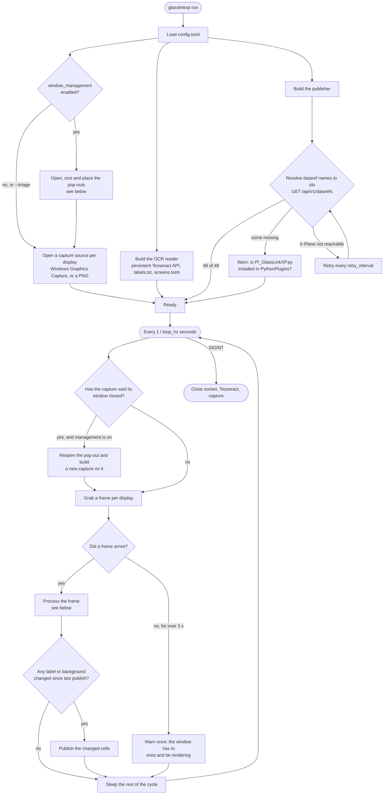
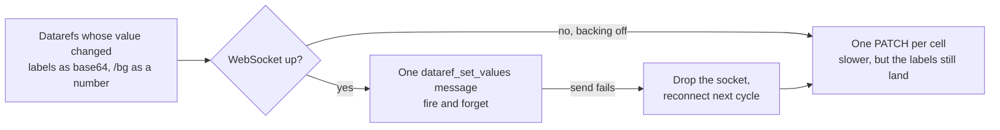
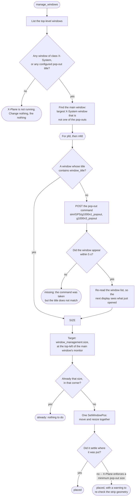
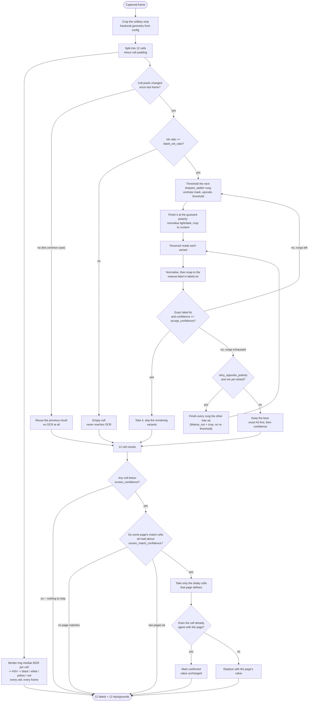

# How the daemon works

Two views: what happens once at startup and on every cycle, and what happens to
a single captured frame.

For the window that drives all of this -- what it spawns, and the places it
reads what the daemon printed -- see [GUI.md](GUI.md).

## The daemon



Publishing prefers one WebSocket message for the whole strip and falls back to
one REST write per changed cell:



## Managing the pop-out windows

On unless you turn it off. One pass runs before the capture sources are opened,
and another whenever a capture reports that its window has closed. It is
idempotent: over a pair of windows that are already right it enumerates the
desktop once and touches nothing.



### Why it is shaped like this

**It is one switch, not three.** Opening a window, sizing it and placing it are
not independently useful: a pop-out this daemon opened lands wherever X-Plane
felt like putting it, at whatever size it felt like using, so opening one
without also sizing and placing it just moves the manual step somewhere else.

**The size must be 4:3.** The G1000 draws a 4:3 panel, and the strip geometry
is stored as *fractions of the client area* -- so a window of any other shape
moves the softkey strip out from under an existing calibration. That failure
appears as labels that will not read, a long way from the setting that caused
it, so a size that is not 4:3 is refused and the default used instead rather
than being taken literally. 1280x960 is the default because the G1000 renders
to a 1024x768 texture and there is nothing to gain below it.

**The top-left corner, of X-Plane's monitor.** The taskbar sits along one edge
of one monitor, normally the bottom, so the opposite corner is the one least
likely to have anything over it. X-Plane's monitor rather than the primary one
because that is where a second screen full of instruments is set up, and the
monitor's own origin rather than its work area because the work area is
*defined* by where the taskbar is -- starting below it would give back exactly
the space this is trying to claim.

**The main window is found by elimination.** Every X-Plane window carries the
same class, pop-outs included, so there is no flag that says "this is the sim".
Dropping the windows that match a configured pop-out title and taking the
largest of the rest separates them in any arrangement anyone is likely to be
flying, since the main view is normally full-screen and a pop-out is not.

**Only `pfd` and `mfd`.** Those are the displays X-Plane has pop-out commands
for. A display configured under any other name is left entirely alone, and
captured however the user has arranged it.

**And nothing else sizes or moves a window at all.** Opening a capture finds
its window and leaves it exactly as it is, for every display. Do not add a
per-display size beside this one: two settings fixing one window's size needs a
rule about which of them wins, and whichever loses is then a setting that is
quietly ignored rather than one that does what it says.

**A closed window is a signal, not something to poll for.** Windows Graphics
Capture calls `on_closed` when the window it was capturing goes away, so the
daemon reopens the pop-out on the next cycle -- within about 36 ms at 28 Hz --
rather than on a timer. Nothing reconnects: a WGC session does not outlive its
window, so the source is replaced rather than repaired. The only interval
involved paces a reopen that *failed*, so that a sim which has shut down does
not have pop-out commands fired at it twelve times a second.

That signal is also why the frame slot has to go empty when the window closes.
It did not, and the bug it hid is the one this recovery exists for: the slot
kept serving the last frame of the closed pop-out, so the labels froze at
whatever they were when the window went, the "no frames" warning never fired
because frames were still arriving, and none of the above was ever reached.
A stale frame is worse than no frame, because no frame is a condition the
daemon can act on.

**`_popout`, not `_popup`.** The two commands differ by two characters and do
visibly similar things. The popup opens the panel *inside* the X-Plane window,
where it is not a top-level window at all and can be neither captured nor
placed. A command name that does not resolve is reported with what the sim
*does* list, rather than with a second guess.

## One frame



### Why it is shaped like this

**Change gating first.** Softkeys change rarely, so almost every cycle finds
nothing new and costs one crop and one array compare. All the expensive work
below only runs on cells whose pixels actually moved.

**Colour is measured outside the gate.** The gate exists to skip OCR, which
is the expensive stage; a median over a cell's border ring is not, so it runs
for all 12 cells on every frame. That is not just tidiness: a softkey becoming
selected changes the cell's background and leaves the label character for
character identical, which is the one event this feature most needs to get
right. Measuring outside the gate means it is caught whether or not the
grayscale comparison happens to notice.

The colour is taken from the outermost few pixels of the cell, because labels
are centred and a border ring is therefore essentially never glyph -- and,
unlike a whole-cell statistic, the ring needs no assumption about the glyphs
being the minority class, so it behaves the same on an inverted cell. It is
summarised with a median so a handful of clipped pixels from the green softkey
outline cannot drag it. Classification then tests V, then S, then hue: hue and
saturation barely move when the display is dimmed, so brightness can only ever
push a cell into black and can never turn a yellow into a red. See the
`dump-colors` subcommand for the measurement the thresholds should come from.

**A ladder rather than one sharpening setting.** The glyphs are around ten
pixels tall. Thresholding at that size can close the counters of 0, 6, 8 and 9,
and a filled counter is not a character -- Tesseract returns an empty string
rather than a wrong digit. Sharpening reopens them, but too much rings and
grows strokes instead, turning a 0 into a B. The amount that works depends on
the font and the capture scale, so each rung is tried and the answer the
vocabulary agrees with wins. The first rung is no sharpening at all.

Picking those rungs from a single cell is exactly what caused the regression
this paragraph is about: a rung strong enough to open up a 0 also, in one real
capture, turned a 6 into a 5 and a 7 into nothing -- because the rung that
fixed one cell was never checked against any other, and the ladder is the same
one every cell on every frame is read with. `tune --truth <file>` (see
`tuning.py`) now searches against every labelled cell on every page it is
given and keeps a candidate only when it fixes something without making
anything else, on any page, read wrong.

**Confidence gates the early exit.** Landing on a known label is not proof:
every digit 0-7 is a valid softkey, so a 0 misread as 2 still matches exactly.
Only a hit that is also confident ends the search.

**And the rungs are built one at a time.** The exit above stops the OCR calls,
but the rungs used to be preprocessed up front, all of them, before the reader
had looked at any -- so the search saved a Tesseract call and paid for an
unsharp mask, a 4x resize and a threshold it never used. They are now produced
as they are asked for. Across the offline corpus that is 63 preprocessing
passes instead of 174 for the same 58 cells, and 9.8 ms per frame down to
4.4 ms. The ladder itself is unchanged -- same rungs, same order, same
answers; only the work nobody was going to look at is skipped.

**Page lookup runs only when something needs it.** The stage exists to serve
cells OCR was unsure about, so the first question is whether any exist. When
every cell read confidently there is nothing to answer and no page is looked
for at all -- which is the common case, and costs one comparison rather than a
scan of the page library.

**Page lookup last.** Recognising a ten-pixel 0 is hard. Noticing that IDENT,
BKSP and BACK occupy cells 9-11 is easy, and that only happens on the
transponder keypad -- whose layout is fixed. So the cells OCR finds hardest are
exactly the ones a page can answer without recognising anything. The page is
identified once per strip, from cells read at a *higher* bar than the one it
fills, so an identification is never built on a guess.

## Reading the debug output

Every command, verbose or not, opens with which build it is and what it was
asked to do:

```
20:26:10 INFO    glasslinkxp: GlassLinkXP 1.2.3: run
```

The number comes from `glasslinkxp/VERSION`, which the release build stamps
with the tag it was built from; a copy built from a checkout says `0.0.0`, and
`NO_VERSION` means there was no VERSION file to read at all -- a dev build, or
a copy it did not ship in. It is the first line of every log so
that a log pasted into an issue answers "which version?" without anyone having
to ask.

`run -v` then prints one line per cell, after page lookup, so the line always
matches the value that gets published:

```
pfd screen lookup: matched 'xpdr-code' on cells [9, 10, 11]; replaced [1]; confirmed [5, 6, 8]
pfd cell 1  bg=black  ink=0.0498 x=0.53-0.63 raw=''   ocr=''   conf=  0.0 match=0.00 -> '0' FROM PAGE 'xpdr-code'
pfd cell 5  bg=black  ink=0.0405 x=0.51-0.60 raw='4'  ocr='4'  conf= 43.0 match=1.00 -> CONFIRMED BY PAGE 'xpdr-code'
pfd cell 7  bg=white  ink=0.0447 x=0.50-0.60 raw='6'  ocr='6'  conf= 96.0 match=1.00
pfd cell 9  bg=black  ink=0.0611 x=0.00-0.97 raw='HKLIS' ocr='' conf= 31.0 match=0.00 CLIPPED? left
pfd cell 12 BLANK   bg=black  ink=0.0000 < 0.0040 (contrast=40) -- never reached OCR
```

A frame where only a background moved does no OCR at all, so it gets a line
of its own rather than passing in silence:

```
pfd cell 3  CACHED  bg=white  was bg=black -- colour changed, label unchanged, no OCR
```

| what you see | what it means |
| --- | --- |
| `bg=` | the cell's background class; absent when `color.enabled` is false |
| `CACHED` | the change gate skipped OCR, but the colour moved anyway |
| `raw` then `ocr` | what Tesseract returned, then the label it snapped to |
| `FROM PAGE` | OCR was unsure and the page supplied the value |
| `CONFIRMED BY PAGE` | OCR was unsure, but the page agreed -- value unchanged |
| neither | read confidently enough that the page was not consulted |
| `BLANK` | discarded before OCR; the ink figure says by how much |
| `x=` | horizontal extent of the ink |
| `CLIPPED?` | the ink reaches the outermost pixel of the crop, and the edges it reaches are named. Ink one pixel in is not flagged: at a geometry known to be right, long labels legitimately come that close, so the boundary itself is the only line that separates a cut glyph from a full one. Both kinds of error are possible -- a label drawn hard against its own cell edge reports a clipping that is really the sim's layout, and a crop that has slipped onto a solid background reports nothing at all. The calibration editor warns from this same function. |
| `POLARITY read the wrong way up` | the answer came from an opposite-polarity retry, so the border ring (see below) answered for the wrong rectangle -- usually a crop that has slipped off the cell onto a separator bar or a neighbour. The label is right; the calibration is the thing to look at. Printed on the variant that *won*, not on the retries that were reached: a label missing from `labels.txt` reaches every rung there is while reading perfectly. |

The distinction between the middle two matters when a label looks wrong: a cell
carrying `CONFIRMED` was checked against a known page, while a bare line means
nothing corroborated it.

## Which way up a cell is

A softkey is drawn light-on-dark normally and dark-on-light when it is
selected, so the polarity has to come out of the pixels.

It is read off the cell's **border ring**. Labels are centred, so the
outermost few pixels of a cell are essentially never glyph, whatever the cell
is doing -- the ring is background by construction, and a majority test over
it needs no assumption at all. This is the same measurement, at the same
`ring_fraction`, that the colour stage uses to name the background; `color.py`
sets out the argument for it at length.

It used to be read off the **middle** of the cell instead, on the assumption
that the glyphs are the minority there, and that is a real assumption that
fails. What crosses the line is the ink coverage of the middle band, which
depends on how tight the crop is *and on which letters the word is made of*.
On a live MFD at `h = 0.0267`, `cell_pad_y = 0.08`, TERRAIN and NEXRAD came
out of preprocessing still white-on-black while `DCLTR-1` -- a longer word, in
the same cells, at the same geometry -- read perfectly: D, C, L, T, R, hyphen
and 1 are thin open shapes and E, R, A, N, X and D are not. There was no crop
tight enough to predict from.

The two tests, measured over the 58 non-blank cells of the offline corpus:

| | light-on-dark cells | light-background cells | gap |
| --- | --- | --- | --- |
| middle band (old) | 0.13 – 0.31 | 0.72 – 0.87 | 0.41 |
| border ring (new) | 0.00 – 0.08 | 0.91 – 1.00 | **0.83** |

The threshold is 0.50 either way. What changed is that it now sits in the
middle of a gap rather than near the edge of one.

The dark surround around a small highlight box is cropped away *before* the
ring is read -- until it is gone, the ring is that surround rather than the
label's own background. `_crop_to_content` guards itself (it fires only on
four or more rows and columns that are more than half bright, which is a box
and never a row of glyphs), so running it earlier changes nothing for a cell
that has no frame.

The bar is **0.75, not the midpoint**, and that asymmetry is deliberate:
light-on-dark is the rule and a light background -- a selected key, a caution,
a warning -- is the exception, so the exception is what has to prove itself
and an ambiguous ring means black. `color.py` already works this way on the
same pixels; its `value_max` is tested first "so brightness can only ever push
a cell into black".

### Where the ring stops working

A band is only clean while the glyph stays out of it, and nothing keeps it
out. A tall glyph reaches the top and bottom bands; a full-width word reaches
the left and right ones. The contamination is one-directional -- it lifts a
dark cell's fraction and lowers a light cell's -- so the two populations close
as the crop tightens. Rendered words at one geometry, varying only how much of
the cell height the glyph fills:

| glyph fills | light-on-dark | light background |
| --- | --- | --- |
| 55% of the cell | ≤ 0.09 | ≥ 0.91 |
| 80% | ≤ 0.77 | ≥ 0.84 |
| 90% | ≤ 0.67 | ≥ 0.71 |

At 90% they overlap, and judging each edge separately and taking the worst
makes it worse rather than better (≤ 0.59 against ≥ 0.56 — the light side
loses more). **There is no threshold there, on any band or combination of
them.** A 27 px cell whose label nearly fills it is in that regime, and no
amount of moving `ring_fraction` or the bar will get it out.

Past that limit the ring is not the answer. It only decides which polarity is
tried **first**, and what settles the cell is the vocabulary -- the
opposite-polarity rung, and the rule in `SoftkeyReader._rank` that a retry
wins only by landing on a known label. Nothing downstream can undo a wrong
answer either: sharpening, upscaling and the threshold method all leave
polarity alone, which is why `tune` reports that no candidate helped and hands
back the defaults -- truthfully, because polarity was not in the space it
searched.

So the other polarity is also a rung, the same answer the sharpening ladder
gave to a value that could not be guessed:

```
auto,     rung 1   <- the sharpening ladder, exactly as it was
auto,     rung 2
auto,     rung 3
opposite, rung 1   <- reached only when nothing above scored a confident hit
opposite, rung 2
opposite, rung 3
```

A retry wins only by landing on a known label. Tesseract reads *something*
out of a cell that is the wrong way up and reports a confidence for it that
means nothing, so without that rule a cell which simply does not read hands
its answer to whichever variant produced the most confident garbage -- and
with six variants rather than three, that is often a retry. The published
label is then wrong *and* the debug line blames the polarity for a cell whose
polarity was never the problem. Landing on a known label is the only evidence
there is that flipping was right; without it, the polarity the ring chose
keeps the cell. Same rule as the bar one stage earlier: ambiguous means the
common case.

Polarity is the *outer* loop on purpose. A cell that reads today stops at the
first variant that lands on a known label confidently, so it never sees a
retry, never pays for one, and cannot have its answer outranked by one. Over
the offline corpus that is every cell: 59 variants built across the six menus
and not one retry. And the retries are cheap when they do run -- both
polarities of a rung come from the same thresholded image and differ by a
`bitwise_not` and a crop, so the second pass is a fraction of the first rather
than a second ladder.

`ocr.retry_opposite_polarity = false` restores the old behaviour.
